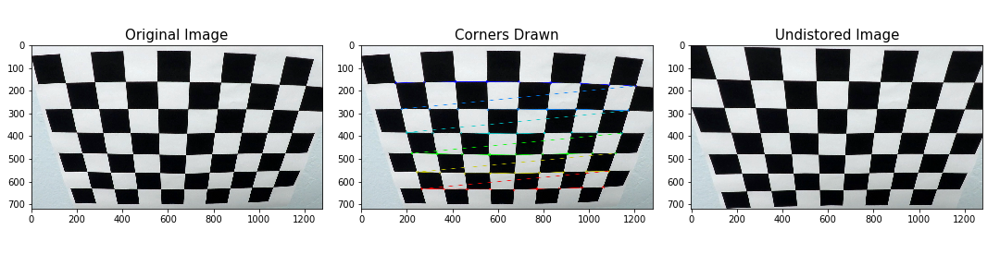
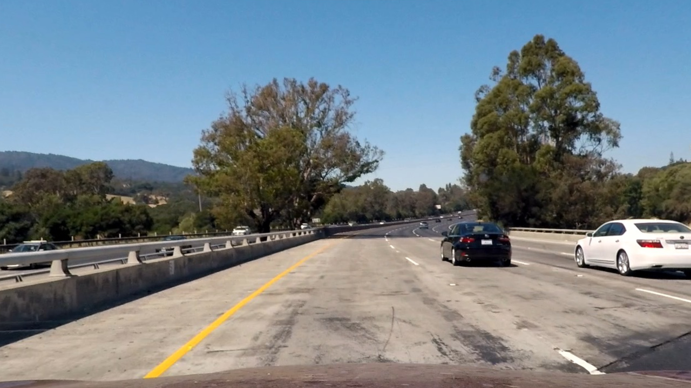
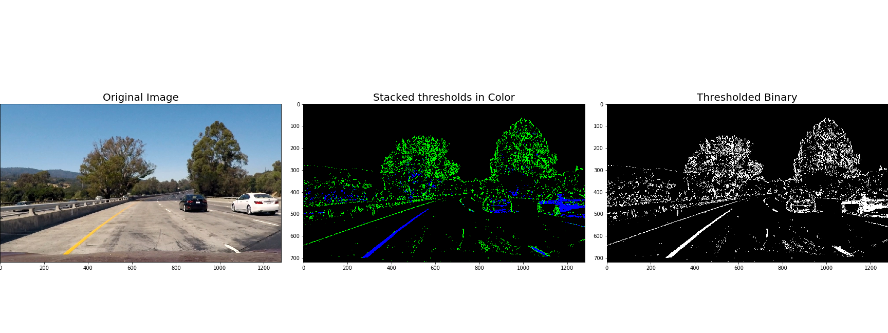
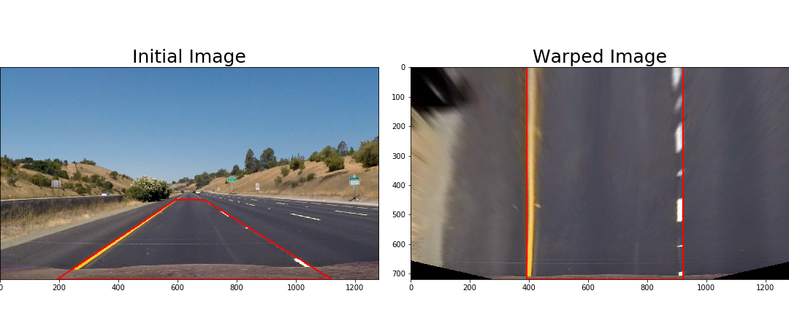
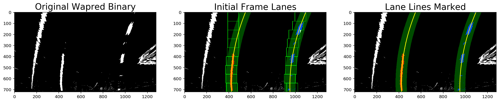
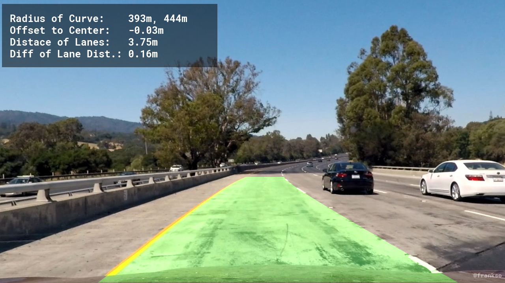

## Writeup for Project Advance Lane Finding
Cao Zhihua 2017-10-15

---

**Advanced Lane Finding Project**

The goals / steps of this project are the following:

* Compute the camera calibration matrix and distortion coefficients given a set of chessboard images.
* Apply a distortion correction to raw images.
* Use color transforms, gradients, etc., to create a thresholded binary image.
* Apply a perspective transform to rectify binary image ("birds-eye view").
* Detect lane pixels and fit to find the lane boundary.
* Determine the curvature of the lane and vehicle position with respect to center.
* Warp the detected lane boundaries back onto the original image.
* Output visual display of the lane boundaries and numerical estimation of lane curvature and vehicle position.

## [Rubric](https://review.udacity.com/#!/rubrics/571/view) Points

### Here I will consider the rubric points individually and describe how I addressed each point in my implementation.  
---

### Camera Calibration

#### 1. Briefly state how you computed the camera matrix and distortion coefficients. Provide an example of a distortion corrected calibration image.

The code for this step is contained in lines 60 through 82 of the file called `advanced_lane_finding.py`).  

I start by preparing "object points", which will be the (x, y, z) coordinates of the chessboard corners in the world. Here I am assuming the chessboard is fixed on the (x, y) plane at z=0, such that the object points are the same for each calibration image.  Thus, `objp` is just a replicated array of coordinates, and `objpoints` will be appended with a copy of it every time I successfully detect all chessboard corners in a test image.  `imgpoints` will be appended with the (x, y) pixel position of each of the corners in the image plane with each successful chessboard detection.  

I then used the output `objpoints` and `imgpoints` to compute the camera calibration and distortion coefficients using the `cv2.calibrateCamera()` function.  I applied this distortion correction to the test image using the `cv2.undistort()` function and obtained this result: 


<br>


```python
ls output_images/
```

    00_initial_image.png              06_histogram_birdview_binary.png
    01_calibration.png                06_lane_lines_detected.png
    02_undistorted.png                08_img_lane_boundary.png
    02_undistorted_02.png             09_final_output_plot.png
    03_color_thresholded.png          10_final_output.png
    04_perspective_matrix.png         save_output_here.txt
    05_birdview_binary.png


### Pipeline (single images)

#### 1. Provide an example of a distortion-corrected image.

To demonstrate this step, I will describe how I apply the distortion correction to one of the test images like this one:

<br>

#### 2. Describe how (and identify where in your code) you used color transforms, gradients or other methods to create a thresholded binary image.  Provide an example of a binary image result.

I used a combination of color and gradient thresholds to generate a binary image (thresholding steps at lines 91 through 122 in `advanced_lane_finding.py`).  Here's an example of my output for this step. 


<br>

#### 3. Describe how (and identify where in your code) you performed a perspective transform and provide an example of a transformed image.

The code for my perspective transform includes functions called `get_perspective_m()` and `warp()`, which appear in lines 252 through 266 in the file `advanced_lane_finding.py`. The `get_perspective_m()` function takes as inputs an image (`img`), as well as source (`src`) and destination (`dst`) points and returen two perspective matrix M and Minv for later use. And then the `warp()` function takes as inputs an image `img` and `M` and return an warped image.  I chose the hardcode the source and destination points in the following manner:

```python
src_pts = np.float32(
    [[688, 450],
     [1120, 720],
     [192, 720],
     [593, 450]])


buffer = 200    # The ammount of more pixels to contain in the birdview image
                # to make sure the lanes are always contained no matter how big
                # the curvature is.
dst_pts = np.float32(
    [[1120 - buffer, 0],
     [1120 - buffer, 720],
     [192 + buffer, 720],
     [192 + buffer, 0]])
```

This resulted in the following source and destination points:

| Source        | Destination   | 
|:-------------:|:-------------:| 
| 688, 450      | 920, 0        | 
| 1120, 720     | 920, 720      |
| 192, 720      | 392, 720      |
| 593, 450      | 392, 0        |

I verified that my perspective transform was working as expected by drawing the `src` and `dst` points onto a test image and its warped counterpart to verify that the lines appear parallel in the warped image.


<br>

#### 4. Describe how (and identify where in your code) you identified lane-line pixels and fit their positions with a polynomial?

Then I did some other stuff and fit my lane lines with a 2nd order polynomial kinda like this (code line 267 through 377:


<br>

#### 5. Describe how (and identify where in your code) you calculated the radius of curvature of the lane and the position of the vehicle with respect to center.

I did this in lines 415 through 444 in my code in `advanced_lane_finding.py`

#### 6. Provide an example image of your result plotted back down onto the road such that the lane area is identified clearly.

I implemented this step in lines 518 through 718 in my code in `advanced_line_finding.py` in the function `pipeline()`.  Here is an example of my result on a test image:


<br>

---

### Pipeline (video)

#### 1. Provide a link to your final video output.  Your pipeline should perform reasonably well on the entire project video (wobbly lines are ok but no catastrophic failures that would cause the car to drive off the road!).

Here's a [link to my video result](./output_project_video_final.mp4)

---

### Discussion

#### 1. Briefly discuss any problems / issues you faced in your implementation of this project.  Where will your pipeline likely fail?  What could you do to make it more robust?

The pipeline I implemented works well on the normal project video, but not so well on the challenge video. The reason is my color thresholding method is not working well to distinguish out the lane line and lane line alike objects. I guess to solve this issue, I need to optimized my color threshold method by combining x,y sobel, magnitude and direction thresholding together with color channel thresholding. 

