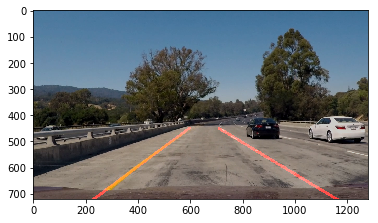

# **Finding Lane Lines on the Road** 

Cao Zhihua   2017-08-12

---

**Finding Lane Lines on the Road**

The goals / steps of this project are the following:
* Make a pipeline that finds lane lines on the road
* Reflect on your work in a written report

[//]: # (Image References)

[image1]: ./examples/grayscale.jpg "Grayscale"

---

### Reflection

### 1. Description of my pipeline

My pipeline consisted of 7 steps.   
1. Convert the images to grayscale with cv2.cvtColor()
2. Blur the image to make the lane lines more smooth with cv2.GaussianBlur()
3. Find the edges in the image with cv2.Canny()
4. Apply an image mask to only keep the region of lane lines with cv2.fillPoly() and cv2.bitwise_and()
5. Get a list of the lane lines location in the image with cv2.HoughLinesP()
6. Draw two lanes lines onto a blank black image with the same shape of the original image by processing the lanes lines found in the previous step and with the function cv2.line()
7. Combine the original image and the image of lanelines with cv2.addWeighted()

In order to draw a single line on the left and right lanes, I wrote a new function called **draw_lines_extend()**. In this new function, I first get a list of all the slopes and intercepts calculated on all the lines by using np.polyfit(). To avoid the horizontal lines which can not be lane lines in the test cases, I excluded the slopes which are between -0.2 and 0.2 from the slopes list. Then I calculated the avarage slopes and intercepts for both left and right lane lines, with which I draw the two single lane lines with cv2.line(). 

*Image sample processed with orginal draw_line() method:*

*Image sample processed with new draw_line_extend() method:*

### 2. Shortcomings with the current pipeline

After using the pipeline described above on the challenge video, the result is not satisf as good as the result from the other test clips. I found out the reason is the that yellow lane lines on the left side is hard to detect by Canny edge detection method due to it's low contrast with the grey color of the road. 

*Original image from challenge video:*

*The yellow lane line on the left is hard to distinguish with road:*

### 3. How I improved  my pipeline
To solve this shortcoming of my pipeline, instead of converting the image from RGB to grayscale on the begining I tried to convert it to HSV and HLS color space. And I found out the HLS worked the best to distinguish the yellow and white lane lines. 

And then use cv.inRange() to filter only the yellow and white color. 

The rest is all the same as the previous pipeline.

*graysclae:*

*blur:*

*edge detection:*

*region selection:*

*hough space and final result:*

### 4. Other potential shortcoming on my pipeline that has to be improved to make the pipeline more robust. 

In my procssed video, I can see that the single lane lines drawn by my pipeline is jittering a little bit as the real lane lines are changing. The possible reason could be that the lane lines are sometime long and sometime short, there are even white dots between dashes in one of the video clips. Also the dashes are sometime missing. 

A possible way to improve this is to give bigger weight to the longer dashes when calculating the average slope and intercept of the lane lines to draw. 

### Conclusion

In general this pipeline did quite a good job when the lane lines are mostly straight lines. But in real world this pipeline won't be robust enough to handle complicated situations. 

In the case of more cuved lane lines and even cross road situation, this pipeline will certainly failed. I assume advanced teniques, such as higher dgree (more than one) curve fitting, have to be used. 

In addition, there are often all kinds of traffic guiding information painted in the middle of car lanes, they will be detected by my current pipeline and impose a huge impace onto the final result. I assume this can be solved by excluding the center area of the car lanes whild masking the "region of interest".  

