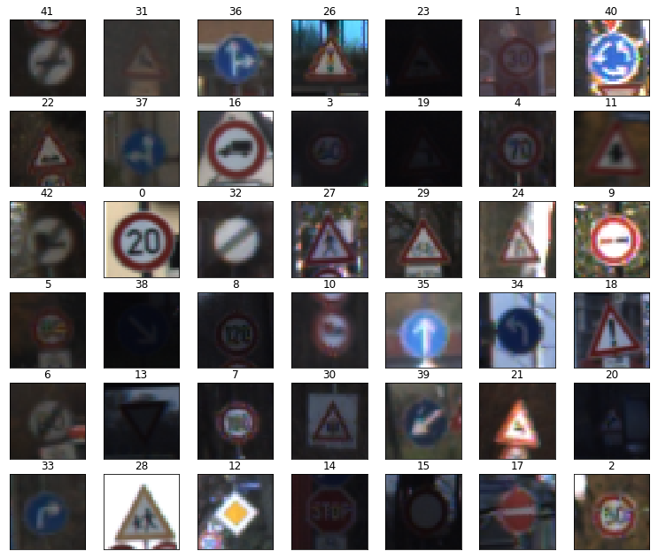

# Traffic Sign Recognition - Project Writeup
**Cao Zhihua 2017.09.10**

### Data Set Summary & Exploration
#### 1. Provide a basic summary of the data set. 
I used the numpy to calculate summary statistics of the traffic signs data set:
* The size of training set is **34799**.
* The size of the validation set is **4410**.
* The size of test set is **12630**.
* The shape of a traffic sign image is **32x32x3**.
* The number of unique classes/labels in the data set is **43**.

#### 2. Include an exploratory visualization of the dataset.
Here are a bunch of exploratory visualizations of the data set. 
**Visualization one:  Show examples of each from 43 traffic signs** 

**Visualization two:  Show more samples of one single traffic sign, in this case the “Priority road”** 

From above visualization we can see the same sign varies greatly in brightness, angle and so on…. 

**Visualization three: A bar chart showing quantity of each traffic sign in the train dataset** 

From the above chart we can see the quantity of each sign differs greatly. 

------------------------

### Design and Test a Model Architecture
#### 1. Describe how you preprocessed the image data. 
Before I send the data to my neural network model for training, I made the following pre-processing on the data after some experimental tryout: 

**Step one: I convert the data to grayscale** 

`X_train_gray = np.array(np.sum(X_train/3, axis=3, keepdims=True))`

**Step two: I normalized the image data because it makes my model have a better  accuracy on the validation data** 

`X_train_gray_norm = (X_train_gray - 128) / 128`

By using the above code, I narrow the variance of the train data to between -1 and 1.

#### 2. Describe what your final model architecture looks like including model type, layers, layer sizes, connectivity, etc.) Consider including a diagram and/or table describing the final model.
I simply build my model mostly based on the Lenet model, because it has a very good performance on the MNIST dataset, which also contains images.

My final model consisted of the following layers:

|Layer                           | Shape    |
|--------------------------------|:--------:|
|Input                           | 32x32x1  |
|Convolution (valid, 5x5x6)      | 28x28x6  |
|Max Pooling (valid, 2x2)        | 14x14x6  |
|Activation  (ReLU)              | 14x14x6  |
|Convolution (valid, 5x5x16)     | 10x10x16 |
|Max Pooling (valid, 2x2)        | 5x5x16   |
|Activation  (ReLU)              | 5x5x16   |
|Flatten                         | 400      |
|Dense                           | 120      |
|Activation  (ReLU)              | 120      |
|Dropout (0.8)                   | 120      |
|Dense                           | 84       |
|Activation  (ReLU)              | 84       |
|Dropout (0.8)                   | 84       |
|Dense                           | 43       |
|Activation  (Softmax)           | 43       |
 

#### 3. Describe how you trained your model. The discussion can include the type of optimizer, the batch size, number of epochs and any hyperparameters such as learning rate.

To train the model, I used **AdamOptimizer** and the following hyperparameters:

| Hyperparameters | value |
|-----------------|:-----:|
|epoch            | 20    |
|batch size       | 128   |
|learning rate    | 0.001 |
|keep_prob        | 0.8   |

#### 4. Describe the approach taken for finding a solution and getting the validation set accuracy to be at least 0.93. 

To find the best solution, I tried the following different approaches:

**Round 1:** Just Lenet 

Just use Lenet model and no pre-processing on the data
Validation Accuracy: 0.834

**Round 2:** Lenet + Dropout (0.8) 

The train accuracy in the round 1 was too high(0.97), it seems it’s overfitting, so I added dropout after the two dense layers with keep_prob value 0.8.  The train accuracy dropped to 0.92 while the validation accuracy is more or less same as round 1. So it works. 
Validation Accuracy: 0.827

**Round 3:**  Lenet + More Dropout (0.7) 

Validation Accuracy: 0.763
**Round 4:** Normalization method 1  + Lenet +  Dropout (0.8) 

Then I tried to normalize the input data before I feed it to Lenet, it worked pretty well.  The method of normalization is as follows:

`X_train_norm = (X_train - 128) / 128`

Validation Accuracy: 0.946

**Round 5:** Normalization method 2  + Lenet +  Dropout (0.8) 

I also tried another way of normalization, but with no better result.

`X_train_norm = X_train / 255 - 0.5`

Validation Accuracy: 0.919

**Round 6:** Grayscale + Normalization method 1 + Lenet +Dropout (0.8)

Based on the most successful pipeline, I tried to convert the image to grayscale before normalization, and it improve the accuracy a lit bit . 

Validation Accuracy: 0.958 

So this is the winner, I decided to use this pipeline. 

**My final model results were:**
* training set accuracy: 0.998
* validation set accuracy: 0.958
* test set accuracy: 0.933

------------------------

### Test a Model on New Images

#### 1. Choose five German traffic signs found on the web and provide them in the report. For each image, discuss what quality or qualities might be difficult to classify.

Here are ten German traffic signs that I found on the web:

The last second image might be difficult to classify because it rotates a little. 

#### 2. Discuss the model’s predictions on these new traffic signs and compare the results to predicting on the test set. 

Here are the results of the prediction:

The model was able to correctly guess 9 of the 10 traffic signs, which gives an accuracy of **90%.** This compares favorably to the accuracy on the test set of 93%.

#### 3. Describe how certain the model is when predicting on each of the five new images by looking at the softmax probabilities for each prediction. 
The top five soft max probabilities for these 10 traffic sings are as follows:

From above we can see that my trained model and do very good confident predictions on most of the sings, but the last second sign, which is actually “Wild Animal Crossing”, but very strange to me is that the top 5 guesses don’t include this correct class.  I believe that’s due to relatively low quantities of data for class 31 in the training data ( n = 690 ).

--------------------
### Summary
In general my trained model can do the classification job on the given traffic signs pretty well.
The reason of the bad result of the one traffic sing is due to the skewed distribution of the number of traffic signs in the training dataset.  To solve this issue, I assume that further actions such as picture augmentation of the picture and generation of fake data to increase the number of some rare traffic sings are needed. 

